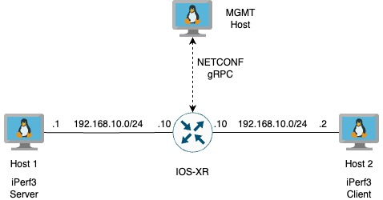

## Device Versions used in the lab

```
| Software       | version   |
| -------------- | --------- |
| python         | `3.10.x`   |
| ncclient       | `0.6.6`   |
| docker         | `19.03.5` |
| docker-compose | `1.23.2`  |
| iperf (server) | `2.0.5`   |
| iperf (client) | `2.0.13`  |
| IOS XR         | `7.9.2`   |
```

### Lab Setup



### Running the Monitoring Stack

Login to the `Management PC` and clone this repository

```
git clone https://github.com/munibshah/xr-netconf.git

cd monitoring
docker-compose build; docker-compose up -d
```

#### Restart the environment

```
docker-compose down; docker-compose build; docker-compose up -d

```

You should not be able to access your Chronograph at `<IP address>:8888`


### IOS-XR Configuration

IOS XR comes with a NETCONF server that can be activated using the following commands:

```
netconf-yang agent ssh
netconf agent tty

ssh server v2
ssh server netconf vrf default
```

Next configure interfaces and enable a telemetry subscription to stream data towards the `Management Client` over gRPC

#### Interface configuration:

```
!
interface MgmtEth0/RP0/CPU0/0
ipv4 address 192.168.1.177 255.255.255.0
!
interface GigabitEthernet0/0/0/0
ipv4 address 192.168.10.10 255.255.255.0
!
interface GigabitEthernet0/0/0/1
ipv4 address 192.168.20.10 255.255.255.0
!

```

#### Model Telemetry Configuration:

```
telemetry model-driven
 destination-group DGroup1
  address-family ipv4 192.168.1.201 port 57777
   encoding self-describing-gpb
   protocol grpc no-tls
  !
 !
 sensor-group SGroupGeneric1
  sensor-path Cisco-IOS-XR-ifmgr-oper:interface-properties/data-nodes/data-node/system-view
 !
 subscription Subscription1
  sensor-group-id SGroupGeneric1 strict-timer
  sensor-group-id SGroupGeneric1 sample-interval 10000
  destination-id DGroup1
```

### Run app.py to connect to IOSXR

Modify the environment variables located in `workshop-configuration.ini`

```
nano workshop-configuration.ini
```

#### Run the Python script to connect to IOSXR using NETCONF

```
source myenv/bin/activate
python3 app.py
```

You should see the following output


### Model Telemetry

Start traffic generation on the Linux Server and Client

#### iperf3 server

```
iperf3 -sD
```

#### iperf3 client

```
iperf3 -c 192.168.10.1 -b 1000000 -d -t 3600 -i 10
```

Login to Chronograph and import the dashboard located at `monitoring/chronograf/Traffic Monitoring.json`

You should see the following output which confirms that IOSXR is sending telemetry towards the `Management Client` over gRPC


Author(s): This lab is an adaption of the DevNet lab written by cprecup <cprecup@cisco.com>
Original repository: https://github.com/munibshah/xr-netconf.git
